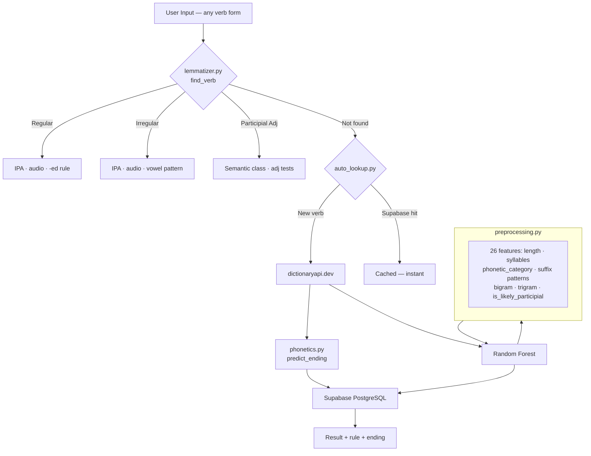

# English Verb Phonetics — NLP & Data Science

---

> *"Walk" → /wɔːk/ → walked → /t/*  
> *"Start" → /stɑːrt/ → started → /ɪd/*  
> *"Love" → /lʌv/ → loved → /d/*  
>
> Why do these sound different? There's a rule. This app finds it — for any English verb.

---

## The Problem

English past tense pronunciation follows a hidden phonetic rule that most learners — and most teachers — never make explicit. The -ed suffix has three distinct sounds, and which one applies is determined entirely by the final **phoneme** of the base verb, not the final letter.

This system makes that logic searchable, audible, and machine-verifiable. It is grounded in Chomsky & Halle (1968) and validated with a trained Random Forest classifier on a custom 473-entry dataset.

---

## Key Findings

- **47.5%** of regular verbs follow the `/d/` ending (~151 of 317) — the most common past tense sound, produced by voiced consonants and vowels
- **28.1%** follow `/t/` (~89 verbs) — voiceless consonants: walk → walk**t**, cook → cook**t**, push → push**t**
- **24.4%** follow `/ɪd/` (~77 verbs) — verbs ending in /t/ or /d/ must insert an extra syllable to separate identical sounds: start → start**id**
- The most frequent irregular pattern is **"no vowel change"** (cut/cut, put/put, hit/hit) — these look regular but aren't
- Second most frequent irregular pattern: **iː → ɛ** (feel/felt, keep/kept, sleep/slept) — 19 verbs
- **Irregular verbs are shorter on average** — reflecting Old English monosyllabic roots. The 10 most frequent English verbs are all irregular
- **Emotional state** is the largest participial adjective class (24 of 76 entries) — *excited, bored, exhausted, worried* — all describe the experiencer, not a physical condition
- **33% of the dataset is irregular** — yet most new English verbs coined after 1900 are regular. Frequency, not age, predicts irregularity
- The **Random Forest reaches ~75% accuracy** distinguishing regular from irregular verbs using spelling features alone — outperforming the 54% majority-class baseline by 21 percentage points
- **Top predictive features:** second-to-last character · verb length · consonant count · vowel count · last letter. Etymology is not a feature — this is the main source of remaining error

---

## What It Does

| Feature | Description |
|---|---|
| **Lemmatizer** | Resolves any conjugated form to its base — `fought → fight`, `went → go`, `broken → break` |
| **Phonetic rule engine** | Predicts -ed ending (`/t/`, `/d/`, `/ɪd/`) from the final phoneme |
| **IPA display** | Full transcription for base, simple past, and past participle |
| **Audio** | Browser speech synthesis for every verb form |
| **ML classifier** | Classifies any unknown verb as regular or irregular — Random Forest, ~75% accuracy |
| **Participial adjectives** | 76 entries across 4 semantic classes with linguistic classification tests |
| **Auto-add pipeline** | Unknown verbs fetched from Dictionary API, classified, saved to Supabase automatically |
| **Model dashboard** | Accuracy, confusion matrix, feature importance, and misclassification analysis |

---

## The Phonetic Rule

When a regular verb takes **-ed**, pronunciation is determined by the **final sound** of the base form — not the final letter:

| Final Sound | -ed Pronounced As | Example |
|---|---|---|
| Voiceless (p, k, f, s, sh, ch) | **/t/** | walk → walk**t** |
| Voiced (vowels, b, g, v, z, m, n, l, r) | **/d/** | call → call**d** |
| /t/ or /d/ | **/ɪd/** (extra syllable) | start → start**id** |

Rule formalized in Chomsky & Halle (1968). Validated here with supervised ML on a custom phonetic dataset.

---

## Dataset

| Sheet | Entries | Key Columns |
|---|---|---|
| Regular Verbs | 317 | Base, Past, Participle, IPA×3, Phonetic×3, Last Sound, Ending |
| Irregular Verbs | 156 | Base, Past, Participle, IPA×3, Phonetic×3, Vowel Change |
| Participial Adjectives | 76 | Base Verb, Form, IPA×2, Semantic Class, Example, Notes |
| **Total** | **473** | — |

Dataset built manually. Not sourced from a tutorial or pre-existing corpus.

---

## Model Performance

| Metric | Score |
|---|---|
| Accuracy | ~75% |
| Precision (weighted) | ~76% |
| Recall (weighted) | ~75% |
| F1 (weighted) | ~75% |
| CV Mean (5-fold) | ~74% |
| Baseline (majority class) | 54% |
| **Over baseline** | **+21 pp** |

---

## ML Features (26 total)

**Structural:** `length` · `vowel_count` · `consonant_count`

**Phonetic:** `syllable_count` · `phonetic_category` · `is_voiceless` · `is_voiced` · `is_stop` · `is_vowel_end` · `is_likely_participial`

**Suffix binary (20):** `ends_e` · `ends_n` · `ends_d` · `ends_t` · `ends_l` · `ends_r` · `ends_k` · `ends_g` · `ends_w` · `ends_y` · `ends_ng` · `ends_nd` · `ends_ld` · `ends_nt` · `ends_in` · `ends_ow` · `ends_aw` · `ends_ck` · `ends_ll` · `ends_se`

**N-gram:** `bigram` · `trigram` · `last_letter` · `second_last`

---

## Project Structure

```
english-verbs-nlp/
├── app.py                        Streamlit app — 6 pages
├── services/
│   ├── lemmatizer.py             Multi-form search + participial adjective support
│   ├── preprocessing.py          26-feature engineering pipeline
│   ├── phonetics.py              Rule-based -ed prediction + semantic class info
│   └── auto_lookup.py            Supabase + Dictionary API auto-add service
├── scripts/
│   └── train_model.py            Standalone training → classifier.pkl + metrics.json
├── models/
│   ├── classifier.pkl            Trained RandomForest (200 estimators, depth 8)
│   ├── metrics.json              Evaluation metrics (machine-readable)
│   └── feature_names.json        Feature column names for inference
├── tests/
│   └── test_services.py          68 unit tests — phonetics, preprocessing, lemmatizer
├── data/
│   └── english_verbs.xlsx        473-entry dataset — 5 sheets
├── requirements.txt
└── README.md
```

---

## Setup

```bash
git clone https://github.com/diegopalencia-research/english-verbs-nlp.git
cd english-verbs-nlp
pip install -r requirements.txt
python scripts/train_model.py     # generates models/classifier.pkl
streamlit run app.py
python -m pytest tests/ -v        # run 68 unit tests
```

For Supabase auto-add, create `.streamlit/secrets.toml`:

```toml
SUPABASE_URL = "https://your-project.supabase.co"
SUPABASE_KEY = "your-anon-key"
```
---

## Architecture



---

## Auto-Add Pipeline

When a user searches a verb not in the local dataset:

```
1. Check Supabase (PostgreSQL)   → instant if previously searched
2. Call dictionaryapi.dev        → free, no API key required
3. Apply phonetic rule engine    → predict -ed ending
4. Run ML classifier             → predict regular / irregular
5. Save to Supabase              → automatically
6. Return result to user         → with IPA, rule, and audio
7. Next user gets it instantly   → from database cache
```

The app grows its own database from user searches. No manual intervention needed.

---

## Participial Adjectives

Past participles functioning as adjectives, classified into 4 semantic categories.

| Class | Count | Examples |
|---|---|---|
| Emotional state | 24 | excited · bored · exhausted · worried |
| Physical state | 15 | broken · frozen · torn · swollen |
| Process result | 19 | cooked · printed · trained · updated |
| Ambiguous | 18 | experienced · advanced · limited · mixed |

**Classification tests:**
- *Very test* — `"very excited"` ✓ natural → adjective
- *Seem test* — `"seem exhausted"` ✓ predicative adjective
- *Attributive* — `"a broken window"` ✓ adjective before noun

---

## Why the Model Fails (~25%)

The classifier uses spelling features only — it has no access to etymology. Short CVC verbs like *cut*, *put*, *hit*, *set* look identical to regular verbs from orthography alone but are irregular. Adding etymology features (Old English vs Latin/French origin) would likely push accuracy above 85%. This is the stated next research direction.

---

## Architecture


---

## App Pages

| Page | Description |
|---|---|
| **Verb Lookup** | Search any form — base, past, or participle. Returns IPA, audio, phonetic rule, sibling verbs |
| **Phonetic Explorer** | Filter regular verbs by -ed ending. Browse irregular patterns with vowel change grid |
| **Charts & Analysis** | Distribution, -ed endings, irregular patterns, verb length — 4 chart tabs |
| **Model Performance** | Live accuracy, precision, recall, F1, confusion matrix, CV scores, feature importance |
| **Verb Reference** | Searchable full table — regular and irregular with pattern filter |

---

## Research Foundation

> *Can phonetic features predict morphological class in English verbs?*

- **Chomsky & Halle (1968)** — *The Sound Pattern of English* — formalization of -ed allomorphy rules
- **Rumelhart & McClelland (1986)** — connectionist past tense benchmark — replicated here with Random Forest
- **Pinker & Prince (1988)** — rule/exception distinction motivating the classification task
- **Berko (1958)** — Wug test — productive morphological rule application in English

Part of a unified preprint: *Computational Feature Extraction for Human Performance Prediction* (OSF Preprints, in preparation).

---

## Requirements

```
pandas>=2.0
openpyxl>=3.1
matplotlib>=3.7
seaborn>=0.12
scikit-learn>=1.3
streamlit>=1.28
numpy>=1.24
requests>=2.28
supabase>=2.0
```

---

## What I Learned

This project taught me the **complete data science workflow**:

1. **Data collection and structuring** — building a dataset from domain knowledge
2. **Exploratory data analysis** — finding patterns in linguistic data
3. **Feature engineering** — turning text/phonetics into ML-ready features
4. **Model training and evaluation** — classification with scikit-learn
5. **Deployment** — shipping a real interactive application

It also showed that **data science is a tool for understanding any domain** — not just finance or tech. Language is data too.

---

## Research Connection

This dashboard operationalizes findings from:
> *Palencia, D. (2024). Computational Feature Extraction for Human Performance Prediction. OSF Preprints.*

The call center context serves as an empirical domain for testing whether temporal and behavioral operational features can predict quality outcomes at the individual agent level — a research question extending the phonological prediction framework from Project 01.

---

**Live App:** https://english-verbs-nlp.streamlit.app/
&nbsp;&nbsp;·&nbsp;&nbsp;
**GitHub:** github.com/diegopalencia-research/english-verbs-nlp

## Author

**Diego José Palencia Robles**
*Data Science & NLP Projects — Applied AI & Analytics + Machine Learning*

- GitHub; @diegopalencia-research: https://github.com/diegopalencia-research
- LinkedIn: https://www.linkedin.com/in/diego-jose-palencia-robles/

---

## License

MIT License


